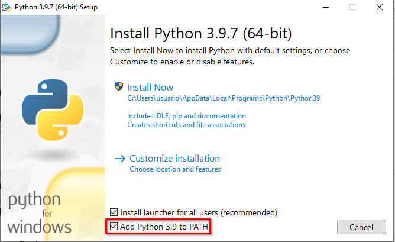
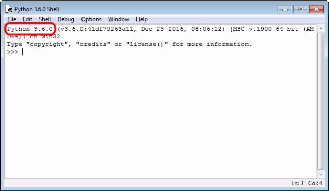
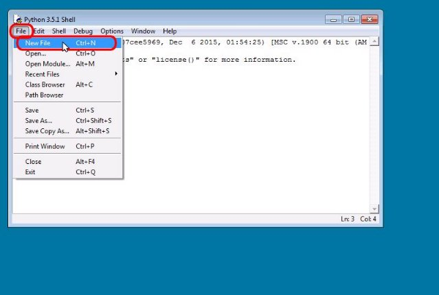
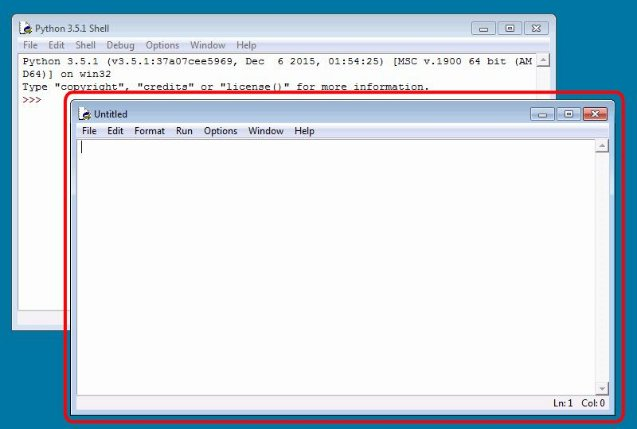
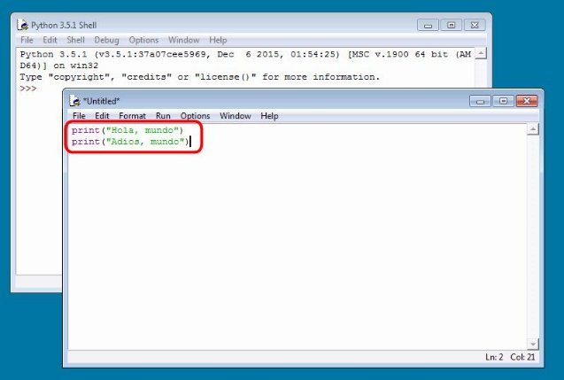
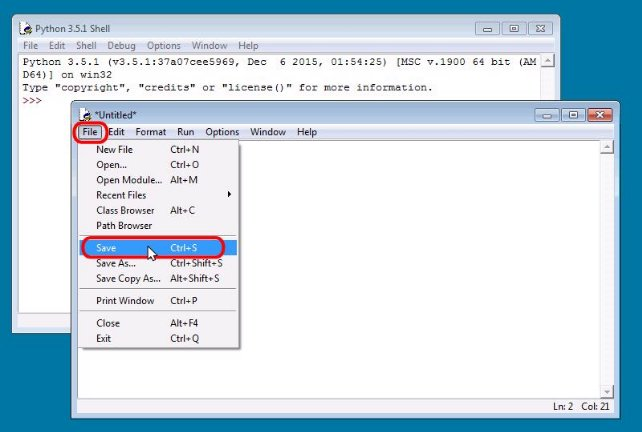
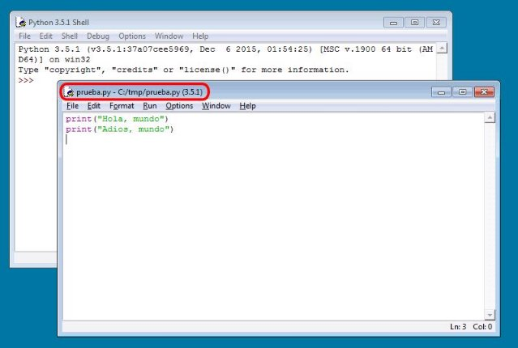
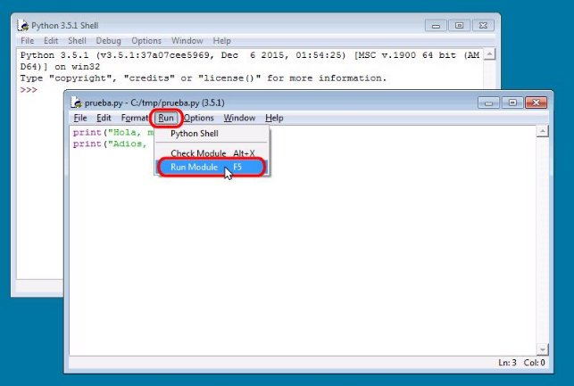
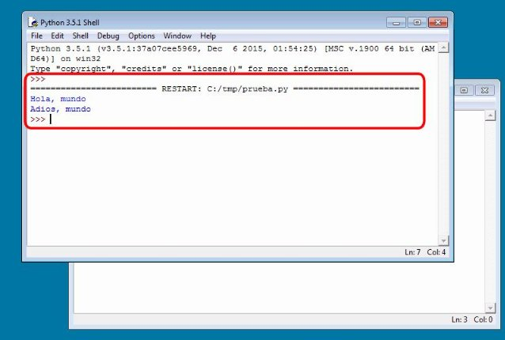

# IDLE, el entorno de desarrollo de Python

## IDLE

IDLE (Integrated DeveLopment Environment for Python) es el entorno de desarrollo que permite editar y ejecutar programas en Python. Se pueden crear y ejecutar programas en Python sin utilizar IDLE, pero IDLE hace mucho más fáciles esas tareas (de hecho, IDLE en inglés significa holgazán).
## Instalación
En Windows Idle está incluido al instalar Python, por tanto sólo tenemos que acceder a la web oficial de Python disponible en  [https://www.python.org/downloads/](https://www.python.org/downloads/) y descargar la última versión.

Al ejecutar el asistente de instalación deberíamos seleccionar la opción de que se añada Python al PATH del sistema



En caso de tener Ubuntu lo instalamos ejecutando:

```bash
$ sudo apt install idle
```

## Primeros pasos

Al abrir el programa se abrirá la ventana principal de IDLE, como muestra la imagen siguiente.



Esta ventana indica la versión de Python instalada.

En la ventana de IDLE se pueden escribir órdenes de Python después del símbolo de 
 petición `>>>`  (en inglés, **prompt**). Al pulsar Intro, IDLE ejecutará la orden inmediatamente. 

Si la orden produce algún resultado, éste se mostrará en color azul y sin el símbolo de petición. Por ejemplo, se puede comprobar que Python sabe sumar dos más dos:
```python
>>> 2 + 2
4
>>>
```

Al terminar de ejecutar la orden, IDLE vuelve a mostrar el símbolo de petición, en espera de una nueva orden.

Se pueden recuperar órdenes anteriores mediante los atajos de teclado:

- **Alt+p** para ver la instrucción anterior (supongo que p es por *previous*, en español, anterior)
- **Alt+n** para ver la instrucción siguiente (supongo que n es por *next*, en español, siguiente)

##  Colores en los programas

Al escribir órdenes en IDLE, algunas palabras cambian de color. Los colores ayudan a identificar los distintos tipos de elementos y a localizar errores:

- Las palabras reservadas de Python (las que forman parte del lenguaje) se muestran en color **naranja**.
- Las cadenas de texto se muestran en **verde**.
- Los resultados de las órdenes se escriben en **azul**.
- Los mensajes de error se muestran en **rojo**.
- Las funciones se muestran en **púrpura**.

Las cadenas de texto deben delimitarse con comillas dobles (") o con comillas simples ('):

```python
>>> print('hola')
hola
>>> print("hola")
hola
>>> 
```

Si la orden contiene algún error, Python escribe un mensaje de error en inglés que indica dónde se ha producido el error y por qué:

```py
>>> print(hola)
Traceback (most recent call last):
  File "/usr/lib/python3.8/idlelib/run.py", line 559, in runcode
    exec(code, self.locals)
  File "<pyshell#3>", line 1, in <module>
NameError: name 'hola' is not defined
>>> 
```

En este ejemplo, el error se debe a que hola no está entre comillas y Python entiende que se hace referencia a una **variable** que se llama hola; al no estar definida previamente ninguna variable que se llame así, se produce un error.

Los argumentos de las funciones deben ir rodeados de paréntesis (en los ejemplos anteriores, la función es la función print() y el argumento de la función, es decir, lo que se le da a la función para que haga su trabajo, es la cadena de texto). Si no se escriben los paréntesis, Python indica que se ha cometido un error de sintaxis:

```python
>>> print "hola"
SyntaxError: Missing parentheses in call to 'print'. Did you mean print("hola")?
>>> 
```

## Conservar los programas en archivos

El inconveniente de la ventana principal de IDLE es que para repetir una orden hay que volver a escribirla. Si simplemente queremos practicar órdenes sencillas la ventana principal de IDLE es suficiente, pero si se trata de un programa más complejo es conveniente guardar el programa en un archivo para poderlo recuperar posteriormente. Como además normalmente los programas no salen bien a la primera, eso permite corregir los errores sin tener que volver a escribir todo.

### 1. Crear archivo nuevo



Para crear un archivo de programa con IDLE, abra una nueva ventana mediante el menú File > New File o mediante la combinación de teclas `CTRL + N`

### 2. El editor de textos



Al elegir esta opción se abrirá una nueva ventana como la de la imagen.

### 3. Creando nuestro programa



En esta ventana ya no aparece el simbolo de petición porque es simplemente un editor de texto (que también colorea las palabras, si el archivo se ha guardado con la extensión .py). Escriba por ejemplo el programa:

```pyth
print("Hola, mundo")
print("Adios, mundo")
```

Oobserva que en esta ventana, cuando se pulsa Intro, no se ejecuta la orden, sino que simplemente se pasa a la línea siguiente.

### 4. Guardando los cambios



Para poder ejecutar el programa, primero es necesario guardar el programa en el disco duro del ordenador. Elija la opción del menú **File > Save o File > Save As ...** para guardar el archivo (también puede utilizar el atajo de teclado **Ctrl+S**).



La primera vez que guarde un programa se abrirá la ventana de diálogo estándar de Windows. Una vez elegida la carpeta y el nombre del archivo, **no olvide escribir también la extensión .py**. Si no escribe la extensión, IDLE no colorea las palabras. Una vez guardado el programa, el nombre del archivo aparece en la barra de título de la ventana.

### 5. Ejecutando el programa



Una vez haya guardado el programa, puede ejecutarlo mediante la opción del menú **Run > Run module** (también puede utilizar la tecla **F5**).




La salida del programa se mostrará en la ventana principal de IDLE.

El procedimiento de trabajo es siempre el mismo: escriba o modifique el programa en la ventana secundaria, guárdelo, ejecútelo y, en su caso, la salida del programa se mostrará en la ventana principal. Si quiere, puede tener varias ventanas secundarias abiertas simultáneamente.

Al escribir un programa tenga cuidado en no escribir espacios en blanco innecesarios al principio de una línea, porque Python mostrará un mensaje de error. 

### Ejecutar programas en ventana de MS-DOS

Se puede ejecutar un programa abriendo una ventana de MS-DOS (**Inicio > Ejecutar > cmd**), cambiando a la carpeta donde esté el programa y escribiendo su nombre (con la extensión).

Por otro lado, como el instalador de Python registra la extensión .py, se puede ejecutar un programa de Python en Windows haciendo **doble clic** sobre él en el explorador de Windows. El problema es que los programas se ejecutan en una ventana de MS-DOS que se abre al iniciarse el programa y que se cierra cuando el programa termina. Para evitar que los programas terminen, se puede añadir una última línea con la función **input()** quese queda esperando a que pulsemos la tecla Intro. Al pulsar Intro, la ventana se cerrará.

El inconveniente de esta solución es que cuando se ejecuta el programa en IDLE, el programa también se queda esperando que pulsemos Intro y es fácil olvidar hacerlo. Si no pulsamos Intro, al ejecutar un segundo programa, IDLE sigue esperando que pulsemos Intro para el primer programa y da la impresión de no funcionar correctamente. 

## Referencias

* Esta página forma parte del curso[ Introducción a la programación con Python](http://www.mclibre.org/consultar/python/) que se distribuye bajo una[ Licencia Creative Commons Reconocimiento-CompartirIgual 4.0 Internacional (CC BY-SA 4.0).](https://creativecommons.org/licenses/by-sa/4.0/deed.es_ES)
