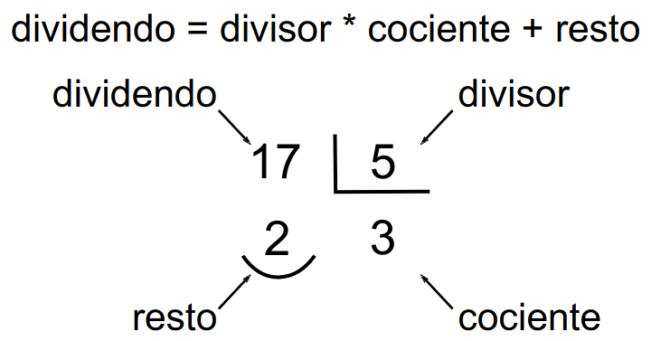
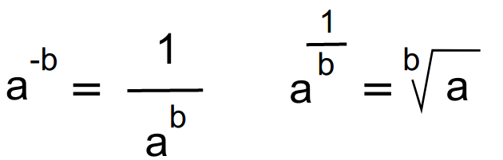

# Números y operaciones aritméticas elementales

En estos apuntes se tratan los tipos de datos numéricos y las operaciones aritméticas elementales en Python.

Los ejemplos que se muestran son el resultado de ejecutar las operaciones en el prompt de un intérprete de Python.

## Tipos de datos numéricos: enteros, reales y números complejos

### Enteros y reales
Python distingue entre números enteros y reales. Al escribir un número real, el separador entre la parte entera y la parte real es un punto.

```python
>>> 3
3
>>> 4.5
4.5
```

Si se escribe una coma como separador entre la parte entera y la real, Python no lo entiende como separador, sino como una pareja de números (concretamente, lo entiende como una tupla de dos elementos, un tipo de datos que veremos más adelante). 

```python
>>> 3,5
(3, 5)
```

Si se escribe un número con parte real 0, Python considera el número como número real.

```python
>>> 3.0
3.0
```
Se puede escribir un número real sin parte entera, pero lo habitual es escribir siempre la parte entera:
```python
>>> .3
0.3
```
### Las cuatro operaciones básicas
Las cuatro operaciones aritméticas básicas son la suma (+), la resta (-), la multiplicación (*) y la división (/).

Al hacer operaciones en las que intervienen números enteros y reales, el resultado es siempre real. En el caso de que el resultado no tenga parte real, Python escribe **0** como parte decimal para indicar que el resultado es un número real:

```python
>>> 4.5 * 3
13.5
>>> 4.5 * 2
9.0
```

Al sumar, restar o multiplicar números enteros, el resultado es entero.

```python
>>> 1 + 2
3
>>> 3 - 4
-1
>>> 5 * 6
30
```


Al dividir números enteros, el resultado es siempre real, aunque sea un número entero. Cuando Python escribe un número real, lo escribe siempre con parte real, aunque sea nula.

```python
>>> 9 / 2
4.5
>>> 9 / 3
3.0
```

Dividir por cero genera un error:

```python
>>> 5 / 0
Traceback (most recent call last):
  File "<input>", line 1, in <module>
    5/0
ZeroDivisionError: division by zero
```

Al realizar operaciones con reales, los resultados pueden presentar errores de redondeo:

```python
>>> 100/3
33.333333333333336
```

Este error se debe a que Python almacena los números reales en binario y pasar de real a binario provoca errores de redondeo. Es un error que sufren casi todos los lenguajes de programación. Si necesitamos precisión absoluta, debemos utilizar **bibliotecas específicas**.

Cuando en una fórmula aparecen varias operaciones, Python las efectúa aplicando las reglas usuales de prioridad de las operaciones (primero multiplicaciones y divisiones, después sumas y restas).

```python
>>> 1 + 2 * 3
7
>>> 10 - 4 * 2
2
```

En caso de querer que las operaciones se realicen en otro orden, se deben utilizar paréntesis.

```python
>>> (10 - 4) * 2
12
```


Debido a los errores de redondeo, dos operaciones que debieran dar el mismo resultado pueden dar resultados diferentes:

```python
>>> 4 * 3 / 5
2.4
>>> 4 / 5 * 3
2.4000000000000004
```


Se pueden escribir sumas y restas seguidas, pero no se recomienda hacerlo porque no es una notación habitual:

```python
>>> 3 + - + 4
-1
>>> 3 + - + - 4
7
```


Lo que no se puede hacer es escribir multiplicaciones y divisiones seguidas:

```python
>>> 3 * / 4
SyntaxError: invalid syntax
```

### Cociente y resto de una división
El cociente y resto de una división están relacionados con el dividendo y divisor mediante la fórmula:




#### Cociente de una división
El cociente de una división se calcula en Python con el operador `//`. El resultado es siempre un número entero, pero será de tipo entero o decimal dependiendo del tipo de los números empleados (en caso de ser real, la parte decimal es siempre cero). Por ejemplo:

```python
>>> 10 // 3
3
>>> 10 // 4
2.5
>>> 20.0 // 7
2.0
>>> 20 // 6.0
3.0
```


El operador cociente // tiene la misma prioridad que la división:

```python
>>> 26 // 5 / 2
2.5
>>> (26//5) / 2

2.5
>>> 26 // (5/2)
10.0
>>> 26 / 5 // 2
2.0
>>> (26/5) // 2
2.0
>>> 26 / (5//2)
13.0
```


#### Resto de una división
El resto de una división se calcula en Python con el operador `%`. El resultado tendrá tipo entero o real, de acuerdo con el resultado de la operación

```python
>>> 10 % 3
1
>>> 10 % 4
2
>>> 10 % 5
0
>>> 10.5 % 3
1.5
```


Cuando el resultado es real, pueden aparecer los problemas de redondeo comentados anteriormente.

```python
>>> 10.2 % 3
1.1999999999999993 # El resultado correcto es 1.2
>>> 10 % 4.2
1.5999999999999996 # El resultado correcto es 1.6
```

El operador resto % tiene la misma prioridad que la división:

```python
>>> 26 % 5 / 2
0.5
>>> (26%5) / 2
0.5
>>> 26 % (5/2)
1.0
```


#### Potencias y raíces
Las potencias se calculan con el operador `**` , teniendo en cuenta que x ** y = x^y^ . Las potencias tienen prioridad sobre las multiplicaciones y divisiones. 

Utilizando exponentes negativos o reales se pueden calcular potencias inversas o raíces n-ésimas.



```python
>>> 2 ** 3
8
>>> 10 ** -4
0.0001           
>>> 9 ** 0.5
3.0              # Recuerde que a1/b es la raíz b-ésima de a
>>> (-1) ** 0.5  # Esto va a dar error porque es la raíz cuadrada de -1
Traceback (most recent call last):
  File "<pyshell#7>", line 1, in ?
    (-1)**0.5 ValueError: negative number cannot be 
raised to a fractional power
>>> -9 ** 0.5    # Esto no da error porque hace primero la raíz y luego le pone el -
-3
```

También se pueden calcular potencias o raíces mediante la función `pow(x,y)`. Si se da un tercer argumento, `pow(x, y, z)`, la función calcula primero x elevado a y  y después calcula el **resto** de la  división por z.

```pyhton
>>> pow(2, 3)
8
>>> pow(4, 0.5)
2.0
>>> pow(2, 3, 5)
3
```

#### Redondear un número

Aunque no se puede dar una regla válida en todas las situaciones, normalmente es conveniente  redondear el resultado de un cálculo cuando se muestra al usuario, sobre todo si tiene muchos decimales, para facilitar su lectura.

Lo que no se debe hacer nunca es redondear **resultados intermedios** que se vayan a utilizar en cálculos posteriores, porque el resultado final será diferente.

##### La función round()

Para redondear un número (por ejemplo, cuando se muestra al usuario el resultado final de un cálculo), se puede utilizar la función `round()`. La función `round()` admite uno o dos argumentos numéricos.

* Si sólo hay **un argumento**, la función devuelve el argumento redondeado al entero más 
  próximo:

```python
>>> round(4.35)
4
>>> round(4.62)
5
>>> round(-4.35)
-4
>>> round(-4.62)
-5
```

* Si se escriben **dos argumentos**, siendo el segundo un número entero, la función round()  devuelve el primer argumento redondeado en la posición indicada por el segundo   argumento.
  * Si el segundo argumento es **positivo**, el primer argumento se redondea con el número de reales indicado:
```python
>>> round(4.3527, 2)
4.35
>>> round(4.3527, 1)
4.4
>>> round(4.3527, 3)
    4.353
```
Si se piden más decimales de los que tiene el número, se obtiene el primer  argumento, sin cambios:
```python
>>> round(4.3527, 7)
4.353
>>> round(435, 2)
435
```
  * Si el segundo argumento es 0, se redondea al entero más próximo, como cuando  no se escribe segundo argumento, pero la diferencia es que el resultado es real y no entero.

```python
>>> round(4.3527, 0)
4.0
>>> round(4.3527)
4
```
Si el primer argumento es un número entero, el resultado sigue siendo el mismo número entero:
```python
>>> round(435, 0)
435
```
  * Si el segundo argumento es negativo, se redondea a decenas, centenas, etc.
```python
>>> round(43527, -1)
43530
>>> round(43527, -2)
43500
>>> round(43527, -3)
44000
>>> round(43527, -4)
40000
>>> round(43527, -5)
0
```
La función **round()** redondea correctamente al número más próximo del orden de magnitud deseado  (entero, décimas, decenas, centésimas, centenas, etc). El problema es cuando el número a redondear está justo en medio (por ejemplo, redondear 3.5 a entero, 4.85 a décimas, etc.). En Matemáticas se suele redondear siempre hacia arriba, pero en Python se sigue otro criterio:

* Cuando se redondea a enteros, decenas, centenas, etc., Python redondea de manera que la 
  última cifra (la redondeada) sea par.
```python
>>> round(3.5)
4
>>> round(4.5)
4
>>> round(5.5)
6
>>> round(6.5)
6
>>> round(450, -2)
400
>>> round(350, -2)
400
>>> round(250, -2)
200
>>> round(150, -2)
200
\>>> round(50, -2)
0
```
* Cuando se redondea a décimas, centésimas, etc., Python redondea en unos casos para arriba y en otros para abajo.
```python
>>> round(3.15, 1)
3.1
>>> round(3.25, 1)
3.2
>>> round(3.35, 1)
3.4
>>> round(3.45, 1)
3.5
>>> round(3.55, 1)
3.5
>>> round(3.65, 1)
3.6
>>> round(0.315, 2)
0.32
>>> round(0.325, 2)
0.33
>>> round(0.335, 2)
0.34
>>> round(0.345, 2)
0.34
>>> round(0.355, 2)
0.35
>>> round(0.365, 2)
0.36
```
Este redondeo se debe a la forma en que Python representa internamente los números 
decimales. Es un problema que presentan la mayoría de lenguajes de programación y se 
explica en el apartado siguiente.

#### Redondear al entero anterior o posterior: las funciones floor() y ceil()

Para redondear un número al entero anterior o posterior, se pueden utilizar las funciones `floor()`  y `ceil()`, que están incluidas en la biblioteca `math`. Estas funciones sólo admiten un argumento  numérico y devuelven valores enteros.

Antes de utilizar estas funciones, hay que importarlas, o se generará un error.

```python
>>> floor(5 / 2)
Traceback (most recent call last):
  File "<pyshell#0>", line 1, in <module>
    floor(5 / 2)
NameError: name 'floor' is not defined
\>>> ceil(5 / 2)
Traceback (most recent call last):
  File "<pyshell#0>", line 2, in <module> 
    ceil(5 / 2)
NameError: name 'ceil' is not defined
>>> from math import floor
>>> floor(5 / 2)
2
>>> from math import ceil
>>> ceil(5 / 2)
3
```

## Referencias

Apuntes generados a partir del curso [Introducción a la programación con Python](http://www.mclibre.org/consultar/python/) que se distribuye bajo una [Licencia Creative Commons Reconocimiento-CompartirIgual 4.0 Internacional (CC BY-SA 4.0).](https://creativecommons.org/licenses/by-sa/4.0/deed.es_ES)
