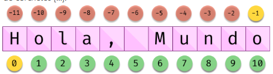

# Cadenas de texto(2)

## Introducción

En el apartado 4 de los apuntes vimos:

*  En que consisten las cadenas de texto
* El uso de comillas simples, dobles y triples para delimitarlas
* El uso de secuencias de escape para mostrar caracteres especiales
* Las operaciones `+`y `*` que permiten concatenar y repetir cadenas respectivamente
* Las cadenas en bruto (raw)
* Y posteriormente vimos las cadenas con formato o formateadas

Ahora veremos aspectos nuevos

## Longitud de una cadena. La función `len()`

La función `len()`nos devuelve el número de caracteres de una cadena que le pasemos como parámetro. 

**Ejemplos**:

```python
>>> print(len("hola"))
4
>>> print(len("\n"))
1
>>> nombre = "Antonio"
>>> print(len(nombre))
7

```

## Accediendo a un determinado carácter o carácteres de una cadena

### Usando indexación de cadenas

Podemos acceder a un determinado caracter de una cadena usando el operador de indexado. Cada letra, espacio o símbolo en una cadena tiene una posición, también denominada índice. La forma de especificar dicha posición es usando corchetes `[]` con el número de la posición dentro de los mismos. El índice siempre empieza a contar por `0` por lo que para acceder a la primera posición debemos  usar el índice 0.

```python
>>> word = "POKEMON"
>>> print(word[0])
P
>>> print(word[3])
E
>>> print(word[6])
N
```


Si intentamos acceder que es mayor que la longitud de la cadena obtendremos un mensaje de error:

```python
>>> word = "POKEMON"
>>> print(word[10])
Traceback (most recent call last):
  File "<input>", line 1, in <module>
    print(word[10])
IndexError: string index out of range
```

### Indexado con números negativos

También podemos usar números negativos para acceder a los caracteres de una cadena de tal forma que si usamos como índice `-1` accederemos al último carácter, `-2` al penúltimo y así sucesivamente.



```python
>>> word = 'Hola, mundo'
>>> print(word[-1])
o
>>> print(word[-2])
d
>>> print(word[-3])
n
>>> print(word[-7])
,

```


### Usando indexado para modificar cadena de caracteres

Las cadenas son objetos de tipo **inmutable**, por tanto el operador de índice lo podemos usar para leer el contenido de una cadena, pero no para modificar su contenido. Si lo intentamos obtenemos un error.

```python
>>> word = "POKEMON"
>>> word[1] = "A"
Traceback (most recent call last):
  File "<input>", line 1, in <module>
    word[1] = "A"
TypeError: 'str' object does not support item assignment
```


### Subcadenas con recorte de cadenas

En ocasiones se puede dar el caso de que queremas obtener varios caracteres de una cadena; una parte de ella o subcadena. Para poder hacerlo Python nos ofrece la posibilidad de que en lugar de poner entre corchetes un único valor poner un rango de la forma `[a:b]`. El comportamiento es similar a cuando usamos dicho operador con listas.

* `a` es la posición en la que se inicia la subcadena (incluyendo este índice)
* `b` es la posición en la que termina la subcadena (**excluyendo** este índice)

**Ejemplos**:

```python
>>> frase = "qué bien lo pasamos!"
>>> frase[0:3]
'qué'
>>> frase[4:8]
'bien'
>>> frase[8:13]
 lo p
```

Es importante que al recortar no se incluye el índice del segundo número sino la posición anterior al mismo.

Los índices negativos empiezan a contar por el final de la cadena:

```python
>>> frase = "qué bien lo pasamos!"
>>> frase[-5:-1]
'amos'
>>> frase[-5:]
'amos!'
```

Se puede usar de forma opcional un tercer parámeretro que indica un incremento a la hora de seleccionar los caracteres:

```python
>>> frase = "qué bien lo pasamos!"
>>> frase[::2]
'qébe opsms'
>>> frase[4:20:3]
'bnoam!'
```

Al igual que en las listas, si intentamos construir subcadenas con índices mayores a la longitud de la cadena no devuelve error y toma como referencia la posición del último carácter de la cadena:

```python
>>> frase = "qué bien lo pasamos!"
>>> frase[4:20]
'bien lo pasamos!'
>>> frase[4:30]
'bien lo pasamos!'

```

### Dividir una cadena

Los objetos de tipo cadena incluyen el método `split()` que permiten convertir una cadena de texto en una lista.

```python
>>> texto = 'No por mucho madrugar ciento volando'
>>> texto.split()
['No', 'por', 'mucho', 'madrugar', 'ciento', 'volando']
```

El método `split()`utiliza por defecto como separador cualquier secuencia de  espacios en blanco, tabuladores y saltos de línea al convertir a lista. Le podemos especificar el caracter separador como parámetro:

 ```python
 >>> estuche = 'lápiz, goma, afilador, regla'
 >>> estuche.split(', ')
 ['lápiz', 'goma', 'afilador', 'regla']
 
 ```

### Limpiar cadenas

Cuando leemos datos de fuentes externas de información es habitual que se incluyan caractéres de relleno al principio o al final.

El método `strip()`limpia por defecto, los espacios en blanco, saltos de línea (`\n`) y tabuladores (`\t`) de una cadena de texto

```python
>>> html  = '  \n  \t  \n <ul><li>item1</li><li>item2</li></ul>   \n\t\t\t'
>>> html.strip()
'<ul><li>item1</li><li>item2</li></ul>'

```

La cadena original no se modifica. Se devuelve la cadena sin los caractéres eliminados.

Si solo queremos limpiar antes o después la cadena podemos usar los métodos `lstrip()` y `rstrip()` respectivamente

```python
>>> html  = '  \n  \t  \n <ul><li>item1</li><li>item2</li></ul>   \n\t\t\t'
>>> html.lstrip()
'<ul><li>item1</li><li>item2</li></ul>   \n\t\t\t'
>>> html.rstrip()
'  \n  \t  \n <ul><li>item1</li><li>item2</li></ul>'
```

### Realizar búsquedas

Python ofrece varios métodos para realizar búsquedas en las cadenas de texto.

Los métodos `startswith()`y `endswith()` devuelven `True` se la cadena empieza o termina respectivamente por el texto a buscar.

```python
>>> zen_python = '''Beautiful is better than ugly.
... Explicit is better than implicit.
... Simple is better than complex.
... Complex is better than complicated.
... Flat is better than nested.'''
>>> zen_python.startswith('Beautiful')
True
>>> zen_python.endswith('ted.')
True
```

Podemos buscar la primera ocurrencia de una subcadena con los métodos `find()` o  `index()`

```python
>>> zen_python = '''Beautiful is better than ugly.
... Explicit is better than implicit.
... Simple is better than complex.
... Complex is better than complicated.
... Flat is better than nested.'''
>>> zen_python.find('than')
20
>>> zen_python.index('than')
20
```

Ambas devuelven el índice de la priemra aparición, su comportamiento es diferente cuando la subcadena no está en la cadena:

```python
>>> zen_python = '''Beautiful is better than ugly.
... Explicit is better than implicit.
... Simple is better than complex.
... Complex is better than complicated.
... Flat is better than nested.'''
>>> zen_python.find('java')
-1
>>> zen_python.index('java')
Traceback (most recent call last):
  File "<input>", line 1, in <module>
    zen_python.index('java')
ValueError: substring not found
```

### Contar aparición de subcadena

También podemos contabilizar el número de veces que aparece una subcadena con `count()`

```python
>>> zen_python = '''Beautiful is better than ugly.
... Explicit is better than implicit.
... Simple is better than complex.
... Complex is better than complicated.
... Flat is better than nested.'''
>>> zen_python.count('better')
5
```

### Reemplazar elementos

Con el método `replace()`podemos reemplazar una subcadena por otra

```python
>>> zen_python = '''Beautiful is better than ugly.
... Explicit is better than implicit.
... Simple is better than complex.
... Complex is better than complicated.
... Flat is better than nested.'''
>>> zen_python.replace('better', 'worst' )
'Beautiful is worst than ugly.\nExplicit is worst than implicit.\nSimple is worst than complex.\nComplex is worst than complicated.\nFlat is worst than ne
sted.'
```

Podemos especificar el número de reemplazos

```python
>>> zen_python = '''Beautiful is better than ugly.
... Explicit is better than implicit.
... Simple is better than complex.
... Complex is better than complicated.
... Flat is better than nested.'''
>>> zen_python.replace('better', 'worst', 2 )
'Beautiful is worst than ugly.\nExplicit is worst than implicit.\nSimple is better than complex.\nComplex is better than complicated.\nFlat is better than nested.'

```

### Mayúsculas y minúsculas

Podemos hacer variaciones en los caractéres para pasarlos a mayúsculas o minúsculas con los métodos `capitalize()`, `title()`, `upper()`, `lower()` y `swapcase()`

```python
>>> refran = 'no por mucho madrugar AMANDECE más temprano' 
>>> refran.capitalize()
'No por mucho madrugar amandece más temprano'
>>> refran.title()
'No Por Mucho Madrugar Amandece Más Temprano'
>>> refran.upper()
'NO POR MUCHO MADRUGAR AMANDECE MÁS TEMPRANO'
>>> refran.lower()
'no por mucho madrugar amandece más temprano'
>>> refran.swapcase()
'NO POR MUCHO MADRUGAR amandece MÁS TEMPRANO'
```


## Referencias

* [CSP Python - Indexado de caracteres](https://teachen.info/cspp/unit2/u0202-strindex.html)

